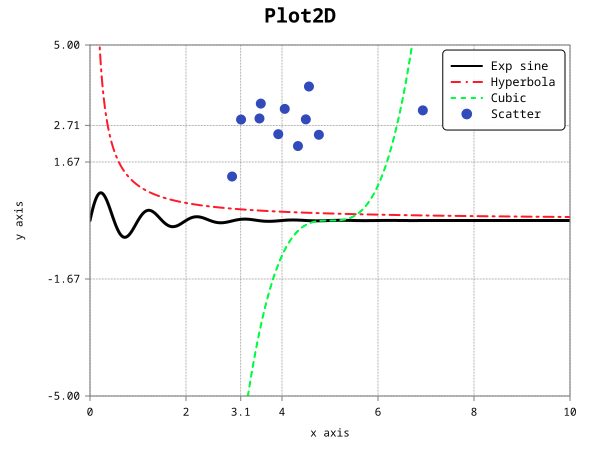
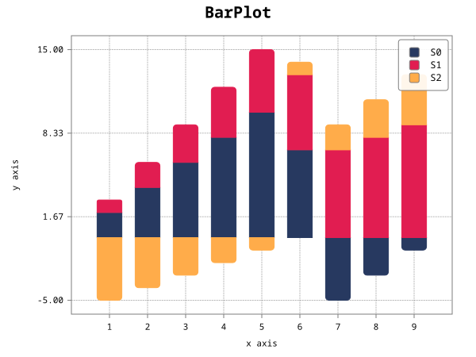
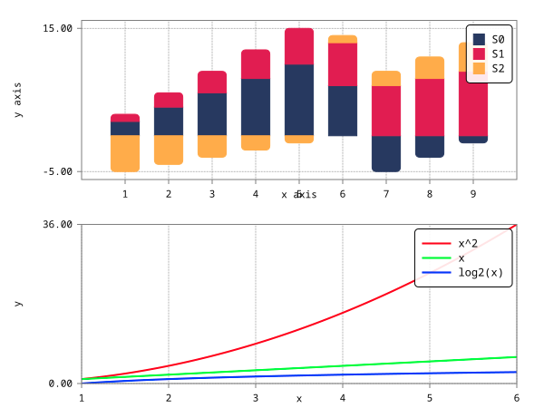

# Introduction
## What is plotcpp?
`plotcpp` is a 2D plotting library for modern C++. Its purpose is to provide a variety of data
visualization devices that are easy to use and integrate into your code. `plotcpp` is aimed at
everyday/casual plotting needs as well as visualisation and debugging.

### How does it work?
`plotcpp` provides `Figure`s, which are the most general visualisation abstraction. A `Figure`
contains one or more plots, which in turn can be configured in many obvious ways and ultimately
built/rendered. A plot can be a pie chart, a histogram, a function plot, etc.

Internally, `plotcpp` represents all visual elements using an SVG description. This allows plots to
be scalable as well as to potentially support an infinity of visual styles while looking nice.

# Contents
1. [Requirements and dependencies](#requirements-and-dependencies)
2. [Building plotcpp](#building-plotcpp)
3. [Using plotcpp](#using-plotcpp)

# Requirements and dependencies
At the moment, `plotcpp` requires at least C++20. It is hard to find a balance between supporting a
broader set of compiler standards and providing modern language features. As stated before, this
library is targeted for use in modern C++ projects.

## Dependencies
`plotcpp` is based on the following dependencies:
* A C++20 compliant compiler.
* [libxml2](https://github.com/GNOME/libxml2)
* [fmt](https://fmt.dev/latest/index.html): Neither `clang` nor `gcc` support `<format>` yet, so fmt
is a temporary workaround.

# Building plotcpp
To build `plotcpp` you need to make sure you have all dependencies installed on your system (see
dependencies). In Fedora, you can achieve this by running

``sudo dnf install libxml2 libxml2-devel fmt-devel``

Other distributions may provide these dependencies through different packages.

First, compile the shared library by running make

``make``

Lastly, install the headers and the shared library:

``sudo make install``

From this point, you can use `plotcpp` in your code, provided that you link your executable with
`libplotcpp`.

# Using plotcpp
## Generating the documentation
`plotcpp` uses `Doxygen` for documentation. You only need to install Doxygen if you want to generate
the documentation. To do that, just run

``make doc``

This will generate a series of `html` files located at `plotcpp/doc/html`. To access the
documentation, open `plotcpp/doc/html/index.html` on your browser. These pages will be useful if you
need to understand the `plotcpp` API to include plots in your program.

## Using plotcpp in your program
In order to use `plotcpp` inside your program you will need to `#include` the `plotcpp` headers.
For example, to include the `Plot2D.hpp` header you need the following:

``#include <plotcpp/Plot2D.hpp>``

To compile your program you will need to link the shared library you installed earlier. Use the
`-lplotcpp` linker flag to achieve that. In some distributions, the `libxml2` headers are not
located at `/usr/include/libxml2`. Normally, the `libxml2` package contains a helper binary that
provides such information. Try running `xml2-config`.This is an example of a command to do all this:

``clang++ -std=c++20 `xml2-config --cflags` -lplotcpp <sources> -o <target>``

## Supported figure types
* [Plot2D](#plot2d)
* [BarPlot](#barplot)
* [HistogramPlot](#histogramplot)
* [GroupFigure](#groupfigure)

### Plot2D
The `Plot2D` figure can plot single variable functions. A number of features are lacking for this
figure type:
* Smart subdivision of axes




### BarPlot
The `BarPlot` figure can represent (stacked) segments of data.

A number of features are lacking for this figure type:
* Axes (and smart subdivision)
* Grid
* Annotated values



### HistogramPlot
The `HistogramPlot` is a `BarPlot` that represents the histogram of a series of values using a
custom number of bins.

Since this figure is based on the `BarPlot` it will be lacking the same features:


### GroupFigure
A `GroupFigure` is simply a group of figures (or subplots). The number of rows and columns are
specified as template arguments `GroupFigure<rows, cols>`. Subplots are added by calling
`Subplot()`:

```C++
plotcpp::Plot2D top;
plotcpp::Plot2D bottom;

// ...

plotcpp::GroupFigure<2, 1> group;
group.Subplot(&top, 0, 0);
group.Subplot(&bottom, 1, 0);
group.Build();

// ...
```

Subplots added to the group can still be modified independently, but be aware that calling `Build()`
on the group will modify the size of the plot.



# Planned features
* Annotated heatmap
* Pie chart
